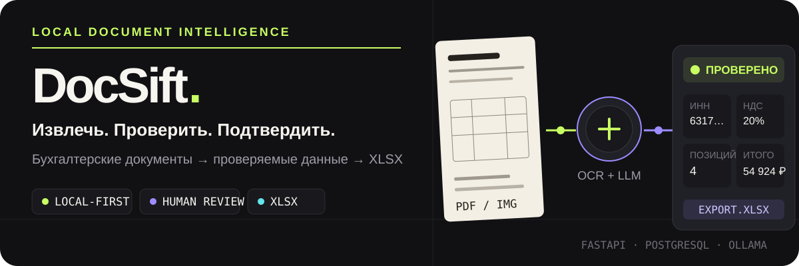
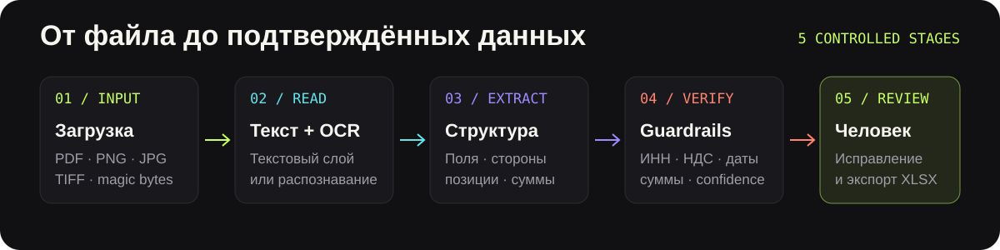

<p align="center">
  
</p>

<p align="center">
  <strong>Локальное приложение для извлечения, проверки и экспорта данных из российских бухгалтерских документов.</strong>
</p>

<p align="center">
  
  
  
  
</p>

<p align="center">
  <a href="#быстрый-запуск">Быстрый запуск</a> ·
  <a href="#как-это-работает">Как это работает</a> ·
  <a href="#поддерживаемые-документы">Типы документов</a> ·
  <a href="#безопасность-и-ограничения">Безопасность</a>
</p>

---

## Из документа — в проверяемые данные

DocSift объединяет OCR, структурированное LLM-извлечение, логические проверки и ручное подтверждение в одном рабочем процессе.

- **Видит структуру, а не только текст.** Извлекает реквизиты сторон, даты, номера, суммы, НДС и табличные позиции.
- **Показывает сомнения.** Guardrails проверяют ИНН, даты, ставки НДС, итоговые суммы и низкую уверенность модели.
- **Оставляет решение человеку.** Поля и позиции можно исправить перед завершением проверки.
- **Даёт прикладной результат.** Подтверждённые данные экспортируются в оформленный XLSX.
- **Работает локально.** Файлы, PostgreSQL и локальный Ollama остаются на машине пользователя.

## Как это работает

<p align="center">
  
</p>

1. Файл проходит проверку расширения, размера и magic bytes.
2. DocSift читает текстовый слой или запускает OCR для скана.
3. LLM возвращает типизированный JSON по схеме документа.
4. Guardrails ищут логические расхождения и значения с низкой уверенностью.
5. Пользователь подтверждает или исправляет данные и скачивает XLSX.

## Что есть в интерфейсе

- очередь документов со статусами обработки;
- split-view: оригинал слева, извлечённые поля справа;
- редактирование реквизитов и табличных позиций;
- отдельная вкладка Guardrails;
- trace с моделью, версией промта, токенами и шагами обработки;
- явное подтверждение предупреждений;
- удаление ошибочно загруженных документов;
- светлая и тёмная темы;
- отчёты по качеству и сравнение eval-запусков.

## Поддерживаемые документы

| Документ | Значение схемы | Что извлекается |
| --- | --- | --- |
| Счёт на оплату | `payment_invoice` | стороны, номер, дата, позиции, суммы, НДС |
| Счёт-фактура | `vat_invoice` | реквизиты, позиции, ставки и суммы НДС |
| УПД | `universal_transfer_document` | статус УПД, операция, стороны и позиции |
| Товарная накладная ТОРГ-12 | `consignment_note_torg12` | поставщик, покупатель, отгрузка и товарная таблица |
| Акт выполненных работ / услуг | `work_completion_act` | стороны, договор, период, услуги и итоги |

**Форматы загрузки:** PDF, PNG, JPG/JPEG, TIFF. Максимальный размер по умолчанию — 20 МБ.

## Быстрый запуск

### Требования

- Python 3.12 или 3.13;
- Docker Desktop;
- Ollama либо OpenAI-compatible endpoint;
- Tesseract OCR — для изображений и PDF без текстового слоя.

### 1. Подготовить окружение

```powershell
git clone https://github.com/yatochkaa/DocSift-Agent.git
cd DocSift-Agent

py -3.13 -m venv .venv
.\.venv\Scripts\Activate.ps1
python -m pip install -e ".[dev]"

Copy-Item .env.example .env
```

Настройте `.env`: подключение к PostgreSQL, LLM-провайдер, модель и версию extraction-промта. Реальный `.env` не должен попадать в Git.

### 2. Запустить PostgreSQL и миграции

```powershell
docker compose up -d postgres
.\.venv\Scripts\python.exe -X utf8 -m alembic upgrade head
```

### 3. Запустить приложение

```powershell
.\.venv\Scripts\python.exe -X utf8 -m uvicorn docsift.main:app --host 127.0.0.1 --port 8000
```

Откройте <http://127.0.0.1:8000>.

## Конфигурация LLM

По умолчанию приложение ориентировано на локальный Ollama, но поддерживает OpenAI-compatible API.

```env
DOCSIFT_LLM_PROVIDER=ollama
DOCSIFT_LLM_BASE_URL=http://localhost:11434
DOCSIFT_LLM_MODEL=qwen2.5:7b-instruct
DOCSIFT_LLM_NATIVE_STRUCTURED_OUTPUT=true
DOCSIFT_LLM_PROMPT_VERSION=v5
```

Для облачного провайдера задайте отдельный endpoint и ключ только в локальном `.env`.

## Проверки качества

```powershell
# Полный набор тестов
.\.venv\Scripts\python.exe -X utf8 -m pytest -q

# Статический анализ
.\.venv\Scripts\python.exe -X utf8 -m ruff check .
```

В `datasets/accounting/v1` находятся восемь пар `PDF + expected.json` для локальных eval-прогонов: счета, ТОРГ-12, акты, счёт-фактура и УПД.

## Архитектура

```text
src/docsift/
├── api/              REST API и tenant-aware зависимости
├── pipeline/         загрузка, хранение и ingest-конвейер
├── services/         OCR, LLM, guardrails и evals
├── schemas/          Pydantic-схемы документов
├── repositories/     доступ к данным
└── web/              FastAPI + Jinja2 + HTMX интерфейс

migrations/           Alembic-миграции
datasets/             тестовый бухгалтерский датасет
tests/                unit, integration, web и security tests
tools/                локальные диагностические утилиты
```

## Безопасность и ограничения

> [!IMPORTANT]
> DocSift сейчас рассчитан на **однопользовательский локальный запуск**. В приложении нет полноценной аутентификации и пользовательской авторизации. Не публикуйте веб-порт и PostgreSQL в интернет.

- запускайте Uvicorn на `127.0.0.1`;
- храните `.env`, API-ключи и `DOCSIFT_WEB_SECRET` только локально;
- используйте отдельный случайный web secret для каждого окружения;
- проверяйте список staged-файлов перед коммитом;
- не считайте ответ LLM подтверждённым до ручной проверки;
- при использовании облачного LLM учитывайте, что текст документа отправляется внешнему провайдеру.

Качество извлечения зависит от читаемости документа, OCR и выбранной модели. Guardrails снижают риск ошибок, но не заменяют бухгалтерскую или юридическую проверку.

---

<p align="center">
  <strong>DocSift Agent</strong><br>
  <sub>Документ остаётся источником. Человек остаётся последней инстанцией.</sub>
</p>
